# Java基础编程

## 1.Java语言概述

### 课程整体内容概述

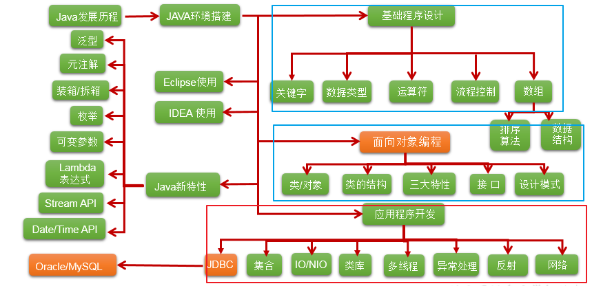

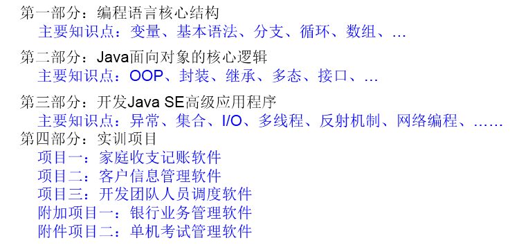

- 项目一：讲完流程控制时，可以做。第二章结束
- 项目二：讲完第四章面向对象（上），可以做
- 项目三：讲完第七章异常处理以后，可以做
- 附加项目一：讲完第七章异常处理以后，可以做
- 附加项目二：讲完第11章IO流以后，可以做

### Java语言概述

1. 基础常识

   1. 软件：即一系列按照特定顺序组织的计算机数据和指令的集合。分为：**系统软件 和 应用软件**

      1. 系统软件：windows , mac os , linux ,unix,android,ios,....
      2. 应用软件：word ,ppt,画图板,...

   2. 人机交互方式： **图形化界面  vs  命令行方式**

   3. **应用程序 = 算法 + 数据结构**

   4. 常用DOS命令：

      

   

2. 计算机语言的发展迭代史

   1. 第一代：机器语言
   2. 第二代：汇编语言
   3. 第三代：高级语言
      1. 面向过程：C,Pascal、Fortran
      2. 面向对象：Java,JS,Python,Scala,...

3. Java语言版本迭代概述

   ```java
   1991年 Green项目，开发语言最初命名为Oak (橡树)
   1994年，开发组意识到Oak 非常适合于互联网
   1996年，发布JDK 1.0，约8.3万个网页应用Java技术来制作
   1997年，发布JDK 1.1，JavaOne会议召开，创当时全球同类会议规模之最
   1998年，发布JDK 1.2，同年发布企业平台J2EE
   1999年，Java分成J2SE、J2EE和J2ME，JSP/Servlet技术诞生
   2004年，发布里程碑式版本：JDK 1.5，为突出此版本的重要性，更名为JDK 5.0
   2005年，J2SE -> JavaSE，J2EE -> JavaEE，J2ME -> JavaME
   2009年，Oracle公司收购SUN，交易价格74亿美元
   2011年，发布JDK 7.0
   2014年，发布JDK 8.0，是继JDK 5.0以来变化最大的版本
   2017年，发布JDK 9.0，最大限度实现模块化
   2018年3月，发布JDK 10.0，版本号也称为18.3
   2018年9月，发布JDK 11.0，版本号也称为18.9
   
   ```

   

4. Java语言应用的领域：

   1. Java Web开发：后台开发
   2. 大数据开发
   3. Android应用程序开发：客户端开发

5. Java语言的特点

   1. **面向对象性**：

      1. 两个要素：类、对象
      2. 三个特征：封装、继承、多态

   2. **健壮性**：

      1. 去除了C语言中的指针
      2. 自动的垃圾回收机制 -->仍然会出现内存溢出、内存泄漏

   3. **跨平台型**：

      1. write once,run anywhere:一次编译，到处运行

      2. 功劳归功于：JVM

         

      

### 开发环境搭建

1. **JDK、JRE、JVM的关系**

   

2. JDK的下载、安装

   1. 下载：官网，github
   2. 安装：傻瓜式安装：JDK 、JRE
   3. 注意问题：安装软件的路径中不能包含中文、空格。

3. path环境变量的配置

   1. 为什么配置path环境变量？

      1. path环境变量：windows操作系统执行命令时所要搜寻的路径
      2. 为什么要配置path:希望java的开发工具（javac.exe,java.exe)在任何的文件路径下都可以执行成功。

   2. 如何配置？

      

   

### 第一个Java程序

1. 开发体验——HelloWorld

   

   1. 编写：创建一个java源文件：HelloWorld.java

      ```java
      class HelloChina{
      	public static void main(String[] args){
      		System.out.println("Hello,World!");
      	}
      }
      ```

      

   2. 编译：javac HelloWorld.java

   3. 运行：java HelloChina

2. 常见问题的解决

   

   

   

3. 总结第一个程序

   1. java程序编写-编译-运行的过程
      1. 编写：我们将编写的java代码保存在以".java"结尾的源文件中
      2. 编译：使用javac.exe命令编译我们的java源文件。格式：javac 源文件名.java
      3. 运行：使用java.exe命令解释运行我们的字节码文件。 格式：java 类名
   2. 在一个java源文件中可以声明多个class。但是，只能最多有一个类声明为public的。
      而且要求声明为public的类的类名必须与源文件名相同。
   3. 程序的入口是main()方法。格式是固定的。
   4. 输出语句：
      1. System.out.println():先输出数据，然后换行
      2. System.out.print():只输出数据
   5. 每一行执行语句都以";"结束。
   6. 编译的过程：编译以后，会生成一个或多个字节码文件。字节码文件的文件名与java源文件中的类名相同。

### 注释与API文档

1. 注释:Comment

   1. 分类：
      1. 单行注释：//
      2. 多行注释：/*    */
      3. 文档注释：/**    */
   2. 作用：
      1. 对所写的程序进行解释说明，增强可读性。方便自己，方便别人
      2.  调试所写的代码
   3. 特点：
      1. 单行注释和多行注释，注释了的内容不参与编译。
           换句话说，编译以后生成的.class结尾的字节码文件中不包含注释掉的信息
      2. 文档注释内容可以被JDK提供的工具 javadoc 所解析，生成一套以网页文件形式体现的该程序的说明文档。
      3. 多行注释不可以嵌套使用

2. Java API 文档：　

   1. API:application programming interface。习惯上：将语言提供的类库，都称为api.
   2. API文档：针对于提供的类库如何使用，给的一个说明书。类似于《新华字典》

3. 良好的编程风格

   

   

### EditPlus的使用

1. 开发工具说明:

   

   

   

2. EditPlus的使用：

   

   

## 2.基本语法

### 关键字与标识符

1. java关键字的使用

   1. 定义：被Java语言赋予了特殊含义，用做专门用途的字符串（单词）

   2. 特点：关键字中所字母都为小写

   3. 具体哪些关键字：

      

      

      

2. 保留字

   1. 现Java版本尚未使用，但以后版本可能会作为关键字使用。
   2. 具体哪些保留字：goto 、const
   3. 注意：自己命名标识符时要避免使用这些保留字

3. 标识符的使用

   1. 定义：凡是自己可以起名字的地方都叫标识符。

   2. 涉及到的结构：
      包名、类名、接口名、变量名、方法名、常量名

   3. 规则：(必须要遵守。否则，编译不通过)

      

   4. 规范：（可以不遵守，不影响编译和运行。但是要求大家遵守）

      

   5. 注意点： 在起名字时，为了提高阅读性，要尽量意义，“**见名知意**”。

#### 代码简洁之道

整理人：尚硅谷 - 宋红康

有意义的命名

1. 介绍
   1. 软件中随处可见命名。我们给变量、函数、参数、类和包命名。我们给源代码及源代码所在目录命名。
   2. 这么多命名要做，不妨做好它。下文列出了取个好名字的几条简单规则。
2. 名副其实,见名知意
        
   1. 变量名太随意，haha、list1、ok、theList 这些都没啥意义
3. 避免误导
   1. 包含List、import、java等类名、关键字或特殊字；
      
   2. 字母o与数字0，字母l与数字1等
      
   3. 提防使用不同之处较小的名称。比如：XYZControllerForEfficientHandlingOfStrings与XYZControllerForEfficientStorageOfStrings
4. 做有意义的区分
   1. 反面教材，变量名：a1、a2、a3
   2.  避免冗余，不要出现Variable、表字段中避免出现table、字符串避免出现nameString，直接name就行，知道是字符串类型
   3.  再比如：定义了两个类：Customer类和CustomerObject类，如何区分？ 定义了三个方法：getActiveAccount()、getActiveAccounts()、getActiveAccountInfo()，如何区分？
5. 使用读得出来的名称
   1. 不要使用自己拼凑出来的单词，比如：xsxm(学生姓名)；genymdhms(生成日期，年、月、日、时、分、秒)
   2. 所谓的驼峰命名法，尽量使用完整的单词
6. 使用可搜索的名称
       
   1.  一些常量，最好不直接使用数字，而指定一个变量名，这个变量名可以便于搜索到.
       
   2. 比如：找MAX_CLASSES_PER_STUDENT很容易，但想找数字7就麻烦了。
7. 避免使用编码
   1. 匈牙利语标记法
                 即变量名表明该变量数据类型的小写字母开始。例如，szCmdLine的前缀sz表示“以零结束的字符串”。
   2.  成员前缀
                避免使用前缀，但是Android中一个比较好的喜欢用m表示私有等，个人感觉比较好
   3. 接口和实现
                作者不喜欢把接口使用I来开头，实现也希望只是在后面添加Imp
8. 避免思维映射
   1. 比如传统上惯用单字母名称做循环计数器。所以就不要给一些非计数器的变量命名为：i、j、k等
9. 类名
   1. 类名与对象名应该是名词与名词短语。如Customer、WikiPage、Account和AddressParser。避免使用Data或Info这样的类名。
   2. 不能使动词。比如：Manage、Process
10. 方法名
    1. 方法名应当是动词或者动词短语。如postPayment、deletePage或save
11. 别扮可爱
    1. 有的变量名叫haha、banana
    2. 别用eatMyShorts()表示abort()
12. 每个概念对应一个词
    1. 项目中同时出现controllers与managers，为什么不统一使用其中一种？
    2. 
       对于那些会用到你代码的程序员，一以贯之的命名法简直就是天降福音。
13. 别用双关语
    1. 有时可能使用add并不合适，比例insert、append。add表示完整的新添加的含义。  
14. 使用解决方案领域名称
    1. 看代码的都是程序员，所以尽量用那些计算机科学术语、算法名、模式名、数学术语，
    2. 依据问题所涉领域来命名不算是聪明的做法。
15. 使用源自所涉问题领域的名称
    1. 如果不能用程序员熟悉的术语来给手头的工作命名，就采用从所涉问题领域而来的名称吧。
    2. 至少，负责维护代码的程序员就能去请教领域专家了。
16. 添加有意义的语境
    1. 可以把相关的变量放到一个类中，使用这个类来表明语境。
17. 不要添加没用的语境
    1. 名字中带有项目的缩写，这样完全没有必要。比如有一个名为“加油站豪华版”（Gas Station Deluxe）的项目，
    2. 在其中给每个类添加GSD前缀就不是什么好策略。
18. 最后的话
    1.  取好名字最难的地方在于需要良好的描述技巧和共有文化背景。

### 变量的使用(重点)

1. 变量的分类

   1. 按数据类型分类

      1.  整型：byte(1字节=8bit) \ short(2字节) \ int(4字节) \ long(8字节)

         1. byte范围：-128 ~ 127
         2. 声明long型变量，必须以"l"或"L"结尾
         3. 通常，定义整型变量时，使用int型。
         4. 整型的常量，默认类型是：int型

      2. 浮点型：float(4字节) \ double(8字节)

         1. 浮点型，表示带小数点的数值
         2. float表示数值的范围比long还大
         3. 定义float类型变量时，变量要以"f"或"F"结尾
         4. 通常，定义浮点型变量时，使用double型。
         5. 浮点型的常量，默认类型为：double

      3. 字符型：char (1字符=2字节)

         1. 定义char型变量，通常使用一对'',内部只能写一个字符
         2. 表示方式：1.声明一个字符 2.转义字符 3.直接使用Unicode 值来表示字符型常量

      4. 布尔型：boolean

         1. 只能取两个值之一：true 、 false
         2. 常常在条件判断、循环结构中使用

         

      

   2. 按声明的位置分类(了解)

      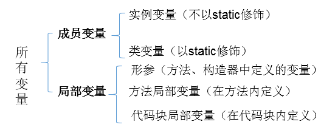

2. 定义变量的格式：

   1. 数据类型  变量名 = 变量值;
   2. 数据类型  变量名;
      变量名 = 变量值;

3. 变量使用的注意点：

   1. 变量必须先声明，后使用
   2. 变量都定义在其作用域内。在作用域内，它是有效的。换句话说，出了作用域，就失效了
   3. 同一个作用域内，不可以声明两个同名的变量

4. 基本数据类型变量间运算规则

   1. 涉及到的基本数据类型：除了boolean之外的其他7种

   2. 自动类型转换(只涉及7种基本数据类型）

      1. 结论：当容量小的数据类型的变量与容量大的数据类型的变量做运算时，结果自动提升为容量大的数据类型。
      2. byte 、char 、short --> int --> long --> float --> double 
      3. 特别的：**当byte、char、short三种类型的变量做运算时，结果为int型**
      4. 说明：此时的容量大小指的是，表示数的范围的大和小。比如：float容量要大于long的容量

   3. 强制类型转换(只涉及7种基本数据类型）：自动类型提升运算的逆运算。

      1. 需要使用强转符：()
      2. 注意点：强制类型转换，可能导致精度损失。

   4. String与8种基本数据类型间的运算

      1. String属于引用数据类型,翻译为：字符串

      2. 声明String类型变量时，使用一对""

      3. String可以和8种基本数据类型变量做运算，且运算只能是连接运算：+

      4. 运算的结果仍然是String类型

      5. 避免：

         ```java
         String s = 123;//编译错误
         String s1 = "123";
         int i = (int)s1;//编译错误
         ```

进制（了解）

1. 编程中涉及的进制及表示方式：

   

2. 二进制的使用说明：

   1. 计算机底层的存储方式：所有数字在计算机底层都以二进制形式存在。

   2. 二进制数据的存储方式：所有的数值，不管正负，底层都以补码的方式存储。

   3. 原码、反码、补码的说明：

      1. 正数：三码合一

      2. 负数：

         

3. 进制间的转换：

   1. 图示：

      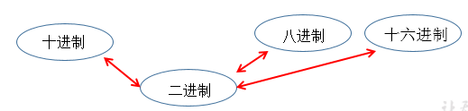

   2. 图示二进制转换为十进制：

      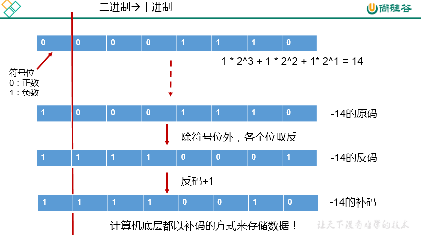

      

      

   3. 图示十进制转换为二进制：

      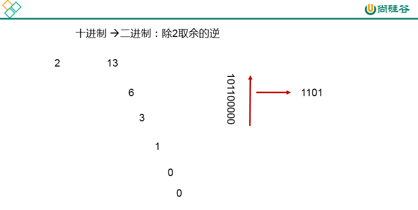

   4. 二进制与八进制、十六进制间的转换：

      

      

      

### 运算符

#### 1-算术运算符

1. 算术运算符： + - + - * / % (前)++ (后)++ (前)-- (后)-- + 

2. 典型代码

   ```java
   		//除号：/
   		int num1 = 12;
   		int num2 = 5;
   		int result1 = num1 / num2;
   		System.out.println(result1);//2
   		// %:取余运算
   		//结果的符号与被模数的符号相同
   		//开发中，经常使用%来判断能否被除尽的情况。
   		int m1 = 12;
   		int n1 = 5;
   		System.out.println("m1 % n1 = " + m1 % n1);
   
   		int m2 = -12;
   		int n2 = 5;
   		System.out.println("m2 % n2 = " + m2 % n2);
   
   		int m3 = 12;
   		int n3 = -5;
   		System.out.println("m3 % n3 = " + m3 % n3);
   
   		int m4 = -12;
   		int n4 = -5;
   		System.out.println("m4 % n4 = " + m4 % n4);
   		//(前)++ :先自增1，后运算
   		//(后)++ :先运算，后自增1
   		int a1 = 10;
   		int b1 = ++a1;
   		System.out.println("a1 = " + a1 + ",b1 = " + b1);
   		
   		int a2 = 10;
   		int b2 = a2++;
   		System.out.println("a2 = " + a2 + ",b2 = " + b2);
   		
   		int a3 = 10;
   		++a3;//a3++;
   		int b3 = a3;
   		//(前)-- :先自减1，后运算
   		//(后)-- :先运算，后自减1
   		
   		int a4 = 10;
   		int b4 = a4--;//int b4 = --a4;
   		System.out.println("a4 = " + a4 + ",b4 = " + b4);
   ```

   

3. 特别说明

   1. **(前)++ :先自增1，后运算；(后)++ :先运算，后自增1**
   2. (前)-- :先自减1，后运算；(后)-- :先运算，后自减1
   3. 连接符：+：只能使用在String与其他数据类型变量之间使用。

#### 2-赋值运算符

1. 赋值运算符：=  +=  -=  *=  /=  %= 

2. 典型代码

   ```java
   		int i2,j2;
   		//连续赋值
   		i2 = j2 = 10;
   		//***************
   		int i3 = 10,j3 = 20;
   		int num1 = 10;
   		num1 += 2;//num1 = num1 + 2;
   		System.out.println(num1);//12
   
   		int num2 = 12;
   		num2 %= 5;//num2 = num2 % 5;
   		System.out.println(num2);
   
   		short s1 = 10;
   		//s1 = s1 + 2;//编译失败
   		s1 += 2;//结论：不会改变变量本身的数据类型
   		System.out.println(s1);
   ```

   

3. 特别说明

   1. 运算的结果不会改变变量本身的数据类型

   2. 开发中，如果希望变量实现+1的操作，有几种方法？(前提：int num = 10;)

      ```java
      		//方式一：num = num + 1;
      		//方式二：num += 1; 
      		//方式三：num++; (推荐)
      ```

#### 3-比较运算符

1. 比较运算符（关系运算符）: == != >  <  >=  <=  instanceof

2. 典型代码

   ```java
   		int i = 10;
   		int j = 20;
   
   		System.out.println(i == j);//false
   		System.out.println(i = j);//20
   
   		boolean b1 = true;
   		boolean b2 = false;
   		System.out.println(b2 == b1);//false
   		System.out.println(b2 = b1);//true
   ```

   

3. 特别说明

   1. 比较运算符的结果是boolean类型

   2.  <   >  >=  <= :只能使用在数值类型的数据之间。

   3. **== 和 !=: 不仅可以使用在数值类型数据之间，还可以使用在其他引用类型变量之间。**

      ```java
      Account acct1 = new Account(1000);
      Account acct2 = new Account(1000);
      boolean b1 = (acct1 == acct2);//比较两个Account是否是同一个账户。
      boolean b2 = (acct1 != acct2);//
      ```

#### 4-逻辑运算符

1. 逻辑运算符：& &&  |  || !  ^

2. 典型代码

   ```java
   		//区分& 与 &&
   		//相同点1：& 与  && 的运算结果相同
   		//相同点2：当符号左边是true时，二者都会执行符号右边的运算
   		//不同点：当符号左边是false时，&继续执行符号右边的运算。&&不再执行符号右边的运算。
   		//开发中，推荐使用&&
   		boolean b1 = true;
   		b1 = false;
   		int num1 = 10;
   		if(b1 & (num1++ > 0)){
   			System.out.println("我现在在北京");
   		}else{
   			System.out.println("我现在在南京");
   		}
   
   		System.out.println("num1 = " + num1);
   		
   
   		boolean b2 = true;
   		b2 = false;
   		int num2 = 10;
   		if(b2 && (num2++ > 0)){
   			System.out.println("我现在在北京");
   		}else{
   			System.out.println("我现在在南京");
   		}
   
   		System.out.println("num2 = " + num2);
   
   		// 区分：| 与 || 
   		//相同点1：| 与  || 的运算结果相同
   		//相同点2：当符号左边是false时，二者都会执行符号右边的运算
   		//不同点3：当符号左边是true时，|继续执行符号右边的运算，而||不再执行符号右边的运算
   		//开发中，推荐使用||
   		boolean b3 = false;
   		b3 = true;
   		int num3 = 10;
   		if(b3 | (num3++ > 0)){
   			System.out.println("我现在在北京");
   		}else{
   			System.out.println("我现在在南京");
   		}
   		System.out.println("num3 = " + num3);
   
   
   		boolean b4 = false;
   		b4 = true;
   		int num4 = 10;
   		if(b4 || (num4++ > 0)){
   			System.out.println("我现在在北京");
   		}else{
   			System.out.println("我现在在南京");
   		}
   		System.out.println("num4 = " + num4);
   ```

   

3. 特别说明

   1. 逻辑运算符操作的都是boolean类型的变量。而且结果也是boolean类型

#### 5-位运算符

1. 位运算符：<<  >> >>> &  |  ^  ~

2. 典型代码

   ```java
   		int i = 21;
   		i = -21;
   		System.out.println("i << 2 :" + (i << 2));
   		System.out.println("i << 3 :" + (i << 3));
   		System.out.println("i << 27 :" + (i << 27));
   
   		int m = 12;
   		int n = 5;
   		System.out.println("m & n :" + (m & n));
   		System.out.println("m | n :" + (m | n));
   		System.out.println("m ^ n :" + (m ^ n));
   ```

   

3. 面试题

   1. 你能否写出最高效的2 * 8的实现方式？ 

      答案：2 << 3  或  8 << 1

4. 特别说明

   1. 位运算符操作的都是整型的数据
   2. **<< ：在一定范围内，每向左移1位，相当于 * 2;>> :在一定范围内，每向右移1位，相当于 / 2**

5. 典型题目：

   1. 交换两个变量的值。
   2. 实现60的二进制到十六进制的转换

#### 6-三元运算符

1. 三元运算符：(条件表达式)? 表达式1 : 表达式2
2. 典型代码
   1. 获取两个整数的较大值
      2.获取三个数的最大值
3. 特别说明
   1. 条件表达式的结果为boolean类型
   2. 根据条件表达式真或假，决定执行表达式1，还是表达式2.
        如果表达式为true，则执行表达式1。
        如果表达式为false，则执行表达式2。
   3. 表达式1 和表达式2要求是一致的。
   4. 三元运算符可以嵌套使用
   5. 凡是可以使用三元运算符的地方，都可以改写为if-else
      反之，不成立。
   6. 如果程序既可以使用三元运算符，又可以使用if-else结构，那么优先选择三元运算符。原因：简洁、执行效率高。

### 流程控制

1. 顺序结构：程序从上到下执行。
2. 分支结构：
   1. if-else        
   2. if- else if  - else if -else
   3. switch-case
3. 循环结构：
   1. for 
   2. while
   3. do-while

#### 分支结构

1. if-else条件判断

   1. 结构
      1. 结构一：
         if(条件表达式){
         	执行表达式
         }
      2. 结构二：二选一
         if(条件表达式){
         	执行表达式1
         }else{
         	执行表达式2
         }
      3. 结构三：n选一
         if(条件表达式){
         	执行表达式1
         }else if(条件表达式){
         	执行表达式2
         }else if(条件表达式){
         	执行表达式3
         }
         ...
         else{
         	执行表达式n
         }
   2. 说明：
      1. else 结构是可选的。
      2. 针对于条件表达式：
         1. 如果多个条件表达式之间是“互斥”关系(或没有交集的关系),哪个判断和执行语句声明在上面还是下面，无所谓。
         2. 如果多个条件表达式之间有交集的关系，需要根据实际情况，考虑清楚应该将哪个结构声明在上面。
         3. **如果多个条件表达式之间有包含的关系，通常情况下，需要将范围小的声明在范围大的上面。否则，范围小的就没机会执行了。**
      3. if-else结构是可以相互嵌套的。
      4. 如果if-else结构中的执行语句只有一行时，对应的一对{}可以省略的。但是，不建议大家省略。

2. switch-case选择结构

   1. 结构

      ```java
      switch(表达式){
      case 常量1:
      	执行语句1;
      	//break;
      case 常量2:
      	执行语句2;
      	//break;
      ...
      default:
      	执行语句n;
      	//break;
      }
      ```

      

   2. 说明：

      1. 根据switch表达式中的值，依次匹配各个case中的常量。一旦匹配成功，则进入相应case结构中，调用其执行语句。当调用完执行语句以后，则仍然继续向下执行其他case结构中的执行语句，直到遇到break关键字或此switch-case结构
           末尾结束为止。
      2. break,可以使用在switch-case结构中，表示一旦执行到此关键字，就跳出switch-case结构
      3. switch结构中的表达式，只能是如下的6种数据类型之一：byte 、short、char、int、枚举类型(JDK5.0新增)、String类型(JDK7.0新增)
      4. case 之后只能声明常量。不能声明范围。
      5. break关键字是可选的。
      6. default:相当于if-else结构中的else.  
           default结构是可选的，而且位置是灵活的。
      7. 如果switch-case结构中的多个case的执行语句相同，则可以考虑进行合并。

#### 循环结构

1. 循环结构的四要素

   ① 初始化条件

   ② 循环条件  --->是boolean类型

   ③ 循环体

   ④ 迭代条件

   说明：通常情况下，循环结束都是因为②中循环条件返回false了。

2. 三种循环结构：

   1. for循环结构

      ```java
      for(①;②;④){
      	③
      }
      执行过程：① - ② - ③ - ④ - ② - ③ - ④ - ... - ②
      ```

      

   2. while循环结构

      ```java
      ①
      while(②){
      	③;
      	④;
      }
      执行过程：① - ② - ③ - ④ - ② - ③ - ④ - ... - ②
      说明：
      写while循环千万小心不要丢了迭代条件。一旦丢了，就可能导致死循环！
      ```

      for和while循环总结：

      1. 开发中，基本上我们都会从for、while中进行选择，实现循环结构。
      2. for循环和while循环是可以相互转换的！ 
           区别：for循环和while循环的初始化条件部分的作用范围不同。
      3. 我们写程序，要避免出现死循环。

   3. do-while循环结构

      ```java
      ①
      do{
      	③;
      	④;
      }while(②);
      执行过程：① - ③ - ④ - ② - ③ - ④ - ... - ②
      ```

      说明：

      1.do-while循环至少会执行一次循环体！

      2.开发中，使用for和while更多一些。较少使用do-while

3. “无限循环”结构: while(true) 或 for(;;)

   1. 总结：如何结束一个循环结构？
      1. 方式一：当循环条件是false时
      2. 方式二：在循环体中，执行break

4. 嵌套循环

   1. 嵌套循环:将一个循环结构A声明在另一个循环结构B的循环体中,就构成了嵌套循环

        内层循环：循环结构A
        外层循环：循环结构B

   2. 说明：

      1. 内层循环结构遍历一遍，只相当于外层循环循环体执行了一次
      2. 假设外层循环需要执行m次，内层循环需要执行n次。此时内层循环的循环体一共执行了m * n次
      3. 外层循环控制行数，内层循环控制列数

   3. 典型练习

      ```java
      		//练习一：
      		/*
      		******
      		******
      		******
      		******
      		*/
      		for(int j = 1;j <= 4;j++ ){
      			for(int i = 1;i <= 6;i++){
      				System.out.print('*');
      			}
      			System.out.println();
      		}
      		//练习二：
      		/*			i(行号)		j(*的个数)
      		*			1			1
      		**			2			2
      		***			3			3
      		****		4			4
      		*****		5			5
      		*/
      
      		for(int i = 1;i <= 5;i++){//控制行数
      			for(int j = 1;j <= i;j++){//控制列数
      				System.out.print("*");
      			
      			}
      			System.out.println();
      		}
      		//练习三：九九乘法表
      		//练习四：100以内的质数
      ```

      

5. 补充:衡量一个功能代码的优劣：

   1. 正确性
   2. 可读性
   3. 健壮性
   4. 高效率与低存储：时间复杂度 、空间复杂度 （衡量算法的好坏）

6. 如何理解流程控制的练习：流程控制结构的使用 + 算法逻辑

#### 关键字：break和continue

|           | 使用范围    | 循环中使用的作用(不同点) | 相同点                     |
| --------- | ----------- | ------------------------ | -------------------------- |
| break:    | switch-case |                          |                            |
| break:    | 循环结构中  | 结束当前循环             | 关键字后面不能声明执行语句 |
| continue: | 循环结构中  | 结束当次循环             | 关键字后面不能声明执行语句 |

补充：带标签的break和continue的使用

return在方法中讲。

#### 补充：Scanner类的使用

```java
/*
如何从键盘获取不同类型的变量：需要使用Scanner类

具体实现步骤：
1.导包：import java.util.Scanner;
2.Scanner的实例化:Scanner scan = new Scanner(System.in);
3.调用Scanner类的相关方法（next() / nextXxx()），来获取指定类型的变量

注意：
需要根据相应的方法，来输入指定类型的值。如果输入的数据类型与要求的类型不匹配时，会报异常：InputMisMatchException
导致程序终止。
*/
//1.导包：import java.util.Scanner;
import java.util.Scanner;

class ScannerTest{
	
	public static void main(String[] args){
		//2.Scanner的实例化
		Scanner scan = new Scanner(System.in);
		
		//3.调用Scanner类的相关方法
		System.out.println("请输入你的姓名：");
		String name = scan.next();
		System.out.println(name);

		System.out.println("请输入你的芳龄：");
		int age = scan.nextInt();
		System.out.println(age);

		System.out.println("请输入你的体重：");
		double weight = scan.nextDouble();
		System.out.println(weight);

		System.out.println("你是否相中我了呢？(true/false)");
		boolean isLove = scan.nextBoolean();
		System.out.println(isLove);

		//对于char型的获取，Scanner没有提供相关的方法。只能获取一个字符串
		System.out.println("请输入你的性别：(男/女)");
		String gender = scan.next();//"男"
		char genderChar = gender.charAt(0);//获取索引为0位置上的字符
		System.out.println(genderChar);	
	}
}
```


## 3.数组

### 数组的概述

1. 数组的理解：数组(Array)，是多个相同类型数据按一定顺序排列的集合，并使用一个名字命名，并通过编号的方式对这些数据进行统一管理。
2. 数组相关的概念：
   1. 数组名
   2. 元素
   3. 角标、下标、索引
   4. 数组的长度：元素的个数
3. 数组的特点：
   1. 数组是有序排列的
   2. 数组属于引用数据类型的变量。数组的元素，既可以是基本数据类型，也可以是引用数据类型
   3. 创建数组对象会在内存中**开辟一整块连续的空间**
   4. 数组的长度一旦确定，就不能修改。
4. 数组的分类：
   1. 按照维数：一维数组、二维数组、。。。
   2. 按照数组元素的类型：基本数据类型元素的数组、引用数据类型元素的数组
5. 数据结构：
   1. 数据与数据之间的逻辑关系：集合、一对一、一对多、多对多
   2. 数据的存储结构：
      1. 线性表：顺序表（比如：数组）、链表、栈、队列
      2. 树形结构：二叉树
      3. 图形结构：
6. 算法：
   1. 排序算法：
   2. 搜索算法：

### 一维数组

1. 一维数组的声明与初始化

   ```java
   		//1. 一维数组的声明和初始化
   		int num;//声明
   		num = 10;//初始化
   		int id = 1001;//声明 + 初始化
   		
   		int[] ids;//声明
   		//1.1 静态初始化:数组的初始化和数组元素的赋值操作同时进行
   		ids = new int[]{1001,1002,1003,1004};
   		//1.2动态初始化:数组的初始化和数组元素的赋值操作分开进行
   		String[] names = new String[5];
   		
   		//错误的写法：
   //		int[] arr1 = new int[];
   //		int[5] arr2 = new int[5];
   //		int[] arr3 = new int[3]{1,2,3};
   		
   		//也是正确的写法：
   		int[] arr4 = {1,2,3,4,5};//类型推断
   		
   		//总结：数组一旦初始化完成，其长度就确定了。
   ```

2. 一维数组元素的引用：

   ```java
   		//2.如何调用数组的指定位置的元素:通过角标的方式调用。
   		//数组的角标（或索引）从0开始的，到数组的长度-1结束。
   		names[0] = "王铭";
   		names[1] = "王赫";
   		names[2] = "张学良";
   		names[3] = "孙居龙";
   		names[4] = "王宏志";//charAt(0)
   //		names[5] = "周扬";
   ```

3. 数组的属性：length

   ```java
   		//3.如何获取数组的长度。
   		//属性:length
   		System.out.println(names.length);//5
   		System.out.println(ids.length);
   ```

4. 一维数组的遍历

   ```java
   		//4.如何遍历数组
   		/*System.out.println(names[0]);
   		System.out.println(names[1]);
   		System.out.println(names[2]);
   		System.out.println(names[3]);
   		System.out.println(names[4]);*/
   		
   		for(int i = 0;i < names.length;i++){
   			System.out.println(names[i]);
   		}
   ```

5. 一维数组元素的默认初始化值

   1. 数组元素是整型：0
   2. 数组元素是浮点型：0.0
   3. 数组元素是char型：0或'\u0000'，而非'0'
   4. 数组元素是boolean型：false
   5. 数组元素是引用数据类型：null

6. 一维数组的内存解析

   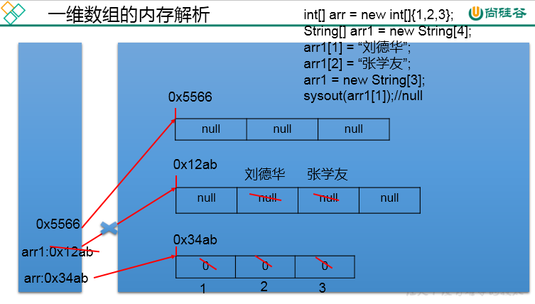

### 二维数组

1. 如何理解二维数组？

   1. 对于二维数组的理解，我们可以看成是一维数组array1又作为另一个一维数组array2的元素而存在。
   2. 其实，从数组底层的运行机制来看，其实没有多维数组。

2. 二维数组的声明与初始化

   ```java
   		//1.二维数组的声明和初始化
   		int[] arr = new int[]{1,2,3};//一维数组
   		//静态初始化
   		int[][] arr1 = new int[][]{{1,2,3},{4,5},{6,7,8}};
   		//动态初始化1
   		String[][] arr2 = new String[3][2];
   		//动态初始化2
   		String[][] arr3 = new String[3][];
   		//错误的情况 
   //		String[][] arr4 = new String[][4];
   //		String[4][3] arr5 = new String[][];
   //		int[][] arr6 = new int[4][3]{{1,2,3},{4,5},{6,7,8}};
   		
   		//也是正确的写法：
   		int[] arr4[] = new int[][]{{1,2,3},{4,5,9,10},{6,7,8}};
   		int[] arr5[] = {{1,2,3},{4,5},{6,7,8}};
   		
   ```

   

3. 如何调用二维数组元素:

   ```java
   		System.out.println(arr1[0][1]);//2
   		System.out.println(arr2[1][1]);//null
   		
   		arr3[1] = new String[4];
   		System.out.println(arr3[1][0]);
   ```

   

4. 二维数组的属性：

   ```java
   		//3.获取数组的长度
   		System.out.println(arr4.length);//3
   		System.out.println(arr4[0].length);//3
   		System.out.println(arr4[1].length);//4
   ```

   

5. 遍历二维数组元素

   ```java
   		//4.如何遍历二维数组
   		for(int i = 0;i < arr4.length;i++){
   			
   			for(int j = 0;j < arr4[i].length;j++){
   				System.out.print(arr4[i][j] + "  ");
   			}
   			System.out.println();
   		}
   ```

   

6. 二维数组元素的默认初始化值

   1. 规定：二维数组分为外层数组的元素，内层数组的元素
      1. `int[][] arr = new int[4][3];`
      2. 外层元素：arr[0],arr[1]等
      3. 内层元素：`arr[0][0]``,arr[1][2]`等
   2. 针对于初始化方式一：比如：`int[][] arr = new int[4][3];`
       *      外层元素的初始化值为：地址值
       *      内层元素的初始化值为：与一维数组初始化情况相同
    3. 针对于初始化方式二：比如：`int[][] arr = new int[4][];`
        *   	外层元素的初始化值为：null
        *      内层元素的初始化值为：不能调用，否则报错。

7. 二维数组的内存结构

   

### 数组的常见算法

1. 数组的创建与元素赋值：杨辉三角（二维数组）、回形数（二维数组）、6个数，1-30之间随机生成且不重复。

2. 针对于数值型的数组：最大值、最小值、总和、平均数等

3. 数组的赋值与复制

   ```java
   int[] array1,array2;
   array1 = new int[]{1,2,3,4};
   ```

   1. 赋值：

      1. array2 = array1;

      2. 如何理解：将array1保存的数组的地址值赋给了array2，使得array1和array2共同指向堆空间中的同一个数组实体。

         

   2. 复制：

      1. ```java
         array2 = new int[array1.length];
         for(int i = 0;i < array2.length;i++){
         array2[i] = array1[i];
         }
         ```

      2. 如何理解：我们通过new的方式，给array2在堆空间中新开辟了数组的空间。将array1数组中的元素值一个一个的赋值到array2数组中。

         

4. 数组元素的反转

   ```java
   	//方法一：
   //		for(int i = 0;i < arr.length / 2;i++){
   //			String temp = arr[i];
   //			arr[i] = arr[arr.length - i -1];
   //			arr[arr.length - i -1] = temp;
   //		}
   		
   		//方法二：
   //		for(int i = 0,j = arr.length - 1;i < j;i++,j--){
   //			String temp = arr[i];
   //			arr[i] = arr[j];
   //			arr[j] = temp;
   //		}
   ```

   

5. 数组中指定元素的查找：搜索、检索

   1. 线性查找： 
      1. 实现思路：通过遍历的方式，一个一个的数据进行比较、查找。
      2. 适用性：具有普遍适用性。
   2. 二分法查找：
      1. 实现思路：每次比较中间值，折半的方式检索。
      2. 适用性：（前提：数组必须有序）

6. 数组的排序算法

   

   理解：

   1. 衡量排序算法的优劣：时间复杂度、空间复杂度、稳定性

   2. 排序的分类：内部排序 与 外部排序（需要借助于磁盘）

   3. 不同排序算法的时间复杂度

      

   4. 手写冒泡排序

      ```java
      		int[] arr = new int[]{43,32,76,-98,0,64,33,-21,32,99};
      		
      		//冒泡排序
      		for(int i = 0;i < arr.length - 1;i++){
      			
      			for(int j = 0;j < arr.length - 1 - i;j++){
      				
      				if(arr[j] > arr[j + 1]){
      					int temp = arr[j];
      					arr[j] = arr[j + 1];
      					arr[j + 1] = temp;
      				}			
      			}			
      		}		
      ```

### Arrays工具类的使用

1. 理解：

   1. 定义在java.util包下。
   2. Arrays:提供了很多操作数组的方法。

2. 使用：

   ```java
   		//1.boolean equals(int[] a,int[] b):判断两个数组是否相等。
   		int[] arr1 = new int[]{1,2,3,4};
   		int[] arr2 = new int[]{1,3,2,4};
   		boolean isEquals = Arrays.equals(arr1, arr2);
   		System.out.println(isEquals);
   		
   		//2.String toString(int[] a):输出数组信息。
   		System.out.println(Arrays.toString(arr1));
   		
   			
   		//3.void fill(int[] a,int val):将指定值填充到数组之中。
   		Arrays.fill(arr1,10);
   		System.out.println(Arrays.toString(arr1));
   		
   
   		//4.void sort(int[] a):对数组进行排序。
   		Arrays.sort(arr2);
   		System.out.println(Arrays.toString(arr2));
   		
   		//5.int binarySearch(int[] a,int key)
   		int[] arr3 = new int[]{-98,-34,2,34,54,66,79,105,210,333};
   		int index = Arrays.binarySearch(arr3, 210);
   		if(index >= 0){
   			System.out.println(index);
   		}else{
   			System.out.println("未找到");
   		}
   
   ```

### 数组的常见异常

1. 数组角标越界异常：ArrayIndexOutOfBoundsException

   ```java
   		int[] arr = new int[]{1,2,3,4,5};
   		
   //		for(int i = 0;i <= arr.length;i++){
   //			System.out.println(arr[i]);
   //		}
   		
   //		System.out.println(arr[-2]);
   		
   //		System.out.println("hello");
   ```

2. 空指针异常：NullPointerException

   ```java
   		//情况一：
   //		int[] arr1 = new int[]{1,2,3};
   //		arr1 = null;
   //		System.out.println(arr1[0]);
   		
   		//情况二：
   //		int[][] arr2 = new int[4][];
   //		System.out.println(arr2[0][0]);
   		
   		//情况：
   		String[] arr3 = new String[]{"AA","BB","CC"};
   		arr3[0] = null;
   		System.out.println(arr3[0].toString());
   ```

   

3. 小知识：一旦程序出现异常，未处理时，就终止执行。


## 4.面向对象-上

### 类与对象

1. **面向对象学习的三条主线：**

   1. Java类及类的成员：属性、方法、构造器；代码块、内部类
   2. 面向对象的大特征：封装性、继承性、多态性、(抽象性)
   3. 其它关键字：this、super、static、final、abstract、interface、package、import等
   4. “大处着眼，小处着手”

2. 面向对象与面向过程（理解）

   1. 面向过程：强调的是功能行为，以函数为最小单位，考虑怎么做。
   2. 面向对象：强调具备了功能的对象，以类/对象为最小单位，考虑谁来做。
   3. 举例对比：人把大象装进冰箱。

3. 完成一个项目（或功能）的思路：

   

   

4. 面向对象中两个重要的概念：

   1. 类：对一类事物的描述，是抽象的、概念上的定义
   2. 对象：是实际存在的该类事物的每个个体，因而也称为实例(instance)
      1. 面向对象程序设计的重点是类的设计
      2. 设计类，就是设计类的成员。
   3. 二者的关系：对象，是由类new出来的，派生出来的。

5. 面向对象思想落地实现的规则

   1. 创建类，设计类的成员
   2. 创建类的对象
   3. 通过“对象.属性”或“对象.方法”调用对象的结构

   - 补充：几个概念的使用说明
     - 属性 = 成员变量 = field = 域、字段
     - 方法 = 成员方法 = 函数 = method
     - 创建类的对象 = 类的实例化 = 实例化类

6. 对象的创建与对象的内存解析

   1. 典型代码：

      ```java
      Person p1 = new Person();
      Person p2 = new Person();
      Person p3 = p1;//没有新创建一个对象，共用一个堆空间中的对象实体。
      ```

      

   2. 说明：

      1. 如果创建了一个类的多个对象，则每个对象都独立的拥有一套类的属性。（非static的）
      2. 意味着：如果我们修改一个对象的属性a，则不影响另外一个对象属性a的值。

   3. 内存解析：

      

      

7. 匿名对象

   1. 我们创建的对象，没显式的赋给一个变量名。即为匿名对象

   2. 特点：匿名对象只能调用一次。

   3. 举例：

      ```java
      		new Phone().sendEmail();
      		new Phone().playGame();
      		
      		new Phone().price = 1999;
      		new Phone().showPrice();//0.0
      ```

      

   4. 应用场景：

      ```java
      PhoneMall mall = new PhoneMall();
      
      //匿名对象的使用
      mall.show(new Phone());
      其中，
      class PhoneMall{
      	public void show(Phone phone){
      		phone.sendEmail();
      		phone.playGame();
      	}
      	
      }
      ```

      

8. 理解"万事万物皆对象"

   1. 在Java语言范畴中，我们都将功能、结构等封装到类中，通过类的实例化，来调用具体的功能结构
      1. Scanner,String等
      2. 文件：File
      3. 网络资源：URL
   2. 涉及到Java语言与前端Html、后端的数据库交互时，前后端的结构在Java层面交互时，都体现为类、对象。

#### JVM内存结构

1. 编译完源程序以后，生成一个或多个字节码文件。

2. 我们使用JVM中的类的加载器和解释器对生成的字节码文件进行解释运行。意味着，需要将字节码文件对应的类加载到内存中，涉及到内存解析。

3. 《JVM规范》

   

   

   1. 虚拟机栈，即为平时提到的栈结构。我们将局部变量存储在栈结构中
   2. 堆，我们将new出来的结构（比如：数组、对象）加载在对空间中。补充：对象的属性（非static的）加载在堆空间中。
   3. 方法区：类的加载信息、常量池、静态域

### 类的结构之一：属性

属性（成员变量）   vs  局部变量

1. 相同点：
   1. 定义变量的格式：数据类型  变量名 = 变量值
   2. 先声明，后使用
   3. 变量都有其对应的作用域 
2. 不同点：
   1. 在类中声明的位置的不同
      1. 属性：直接定义在类的一对{}内
      2. 局部变量：声明在方法内、方法形参、代码块内、构造器形参、构造器内部的变量
   2. 关于权限修饰符的不同
      1. 属性：可以在声明属性时，指明其权限，使用权限修饰符。
          * 			常用的权限修饰符：private、public、缺省、protected  --->封装性
          * 			目前，大家声明属性时，都使用缺省就可以了。
       2. 局部变量：不可以使用权限修饰符。
    3. 默认初始化值的情况：
        1. 属性：类的属性，根据其类型，都有默认初始化值。
            1. 整型（byte、short、int、long）：0
            2. 浮点型（float、double）：0.0
            3. 字符型（char）：0  （或'\u0000'）
            4. 布尔型（boolean）：false
            5. 引用数据类型（类、数组、接口）：null
        2. 局部变量：没有默认初始化值。
            1. 意味着，我们在调用局部变量之前，一定要显式赋值。
            2. 特别地：形参在调用时，我们赋值即可。
    4. 在内存中加载的位置：
        1. 属性：加载到堆空间中   （非static）
        2. 局部变量：加载到栈空间

### 类的结构之二：方法

方法：描述类应该具有的功能。

- 比如：Math类：sqrt()\random() \...
- Scanner类：nextXxx() ...
- Arrays类：sort() \ binarySearch() \ toString() \ equals() \ ...

1. 举例：

   - public void eat(){}
   - public void sleep(int hour){}
   - public String getName(){}
   - public String getNation(String nation){}

2. 方法的声明：

   ```java
   权限修饰符  返回值类型  方法名(形参列表){
   	方法体
   }
   ```

   注意：static、final、abstract 来修饰的方法，后面再讲。

3. 说明：

   1. 关于权限修饰符：默认方法的权限修饰符先都使用public
      1. Java规定的4种权限修饰符：private、public、缺省、protected  -->封装性再细说
   2. 返回值类型： 有返回值  vs 没有返回值
      1. 如果方法有返回值，则必须在方法声明时，指定返回值的类型。同时，方法中，需要使用return关键字来返回指定类型的变量或常量：“return 数据”。
      2. 如果方法没有返回值，则方法声明时，使用void来表示。通常，没有返回值的方法中，就不需要使用return.但是，如果使用的话，只能“return;”表示结束此方法的意思。
      3. 我们定义方法该不该有返回值？
         1. 题目要求
         2. 凭经验：具体问题具体分析
   3. 方法名：属于标识符，遵循标识符的规则和规范，“见名知意”
   4. 形参列表： 方法可以声明0个，1个，或多个形参。
      1. 格式：数据类型1 形参1,数据类型2 形参2,...
      2. 我们定义方法时，该不该定义形参？
         1. 题目要求
         2. 凭经验：具体问题具体分析
   5. 方法体：方法功能的体现。 		

4. 方法的使用中，可以调用当前类的属性或方法

   1. 特殊的：方法A中又调用了方法A:递归方法。
   2. 方法中，不可以定义方法。

#### 关键字:return

1. 使用范围：使用在方法体中
2. 作用
   1. 结束方法
   2. 针对于有返回值类型的方法，使用"return 数据"方法返回所要的数据。
3. 注意点：return关键字后面不可以声明执行语句。

#### 方法的重载

1. 方法的重载的概念

   1. 定义：在同一个类中，允许存在一个以上的同名方法，只要它们的参数个数或者参数类型不同即可。
   2. "两同一不同":同一个类、相同方法名；参数列表不同：参数个数不同，参数类型不同

2. 构成重载的举例：

   1. 举例一：Arrays类中重载的sort() / binarySearch()；PrintStream中的println()

   2. 举例二：

      ```java
      //如下的4个方法构成了重载
      	public void getSum(int i,int j){
      		System.out.println("1");
      	}
      	
      	public void getSum(double d1,double d2){
      		System.out.println("2");
      	}
      	
      	public void getSum(String s ,int i){
      		System.out.println("3");
      	}
      	
      	public void getSum(int i,String s){
      		System.out.println("4");
      	}
         
      	//不构成重载的举例：
      	//如下的3个方法不能与上述4个方法构成重载
      //	public int getSum(int i,int j){
      //		return 0;
      //	}
      	
      //	public void getSum(int m,int n){
      //		
      //	}
      	
      //	private void getSum(int i,int j){
      //		
      //	}
      ```

      

3. 如何判断是否构成方法的重载？

   1. 严格按照定义判断：两同一不同。
   2. 跟方法的权限修饰符、返回值类型、形参变量名、方法体都没有关系！

4. 如何确定类中某一个方法的调用：方法名 ---> 参数列表

5. 面试题：方法的重载与重写的区别？

   1. throws\throw
   2. String\StringBuffer\StringBuilder
   3. Collection\Collections
   4. final\finally\finalize
   5. ....
   6. 抽象类、接口
   7. sleep() / wait()

#### 可变个数形参的方法

1. 使用说明：

   1. jdk 5.0新增的内容
   2. 具体使用：
      1. 可变个数形参的格式：数据类型 ... 变量名
      2. 当调用可变个数形参的方法时，传入的参数个数可以是：0个，1个,2个，。。。
      3. 可变个数形参的方法与本类中方法名相同，形参类型不同的方法之间构成重载
      4. 可变个数形参的方法与本类中方法名相同，形参类型也相同的数组之间不构成重载。换句话说，二者不能共存。
      5. 可变个数形参在方法的形参中，必须声明在末尾
      6. 可变个数形参在方法的形参中,最多只能声明一个可变形参。

2. 举例说明：

   ```java
   	public void show(int i){
   		
   	}
   	
   	public void show(String s){
   		System.out.println("show(String)");
   	}
   	
   	public void show(String ... strs){
   		System.out.println("show(String ... strs)");
   		
   		for(int i = 0;i < strs.length;i++){
   			System.out.println(strs[i]);
   		}
   	}
   	//不能与上一个方法同时存在
   //	public void show(String[] strs){
   //		
   //	}
   		//调用时：
   		test.show("hello");
   		test.show("hello","world");
   		test.show();
   		
   		test.show(new String[]{"AA","BB","CC"});
   ```

#### java的值传递机制

1. 针对于方法内变量的赋值举例：

   ```java
   		System.out.println("***********基本数据类型：****************");
   		int m = 10;
   		int n = m;
   		
   		System.out.println("m = " + m + ", n = " + n);
   		
   		n = 20;
   		
   		System.out.println("m = " + m + ", n = " + n);
   		
   		System.out.println("***********引用数据类型：****************");
   		
   		Order o1 = new Order();
   		o1.orderId = 1001;
   		
   		Order o2 = o1;//赋值以后，o1和o2的地址值相同，都指向了堆空间中同一个对象实体。
   		
   		System.out.println("o1.orderId = " + o1.orderId + ",o2.orderId = " +o2.orderId);
   		
   		o2.orderId = 1002;
   		
   		System.out.println("o1.orderId = " + o1.orderId + ",o2.orderId = " +o2.orderId);
   		
   ```

   规则：

   - 如果变量是基本数据类型，此时赋值的是变量所保存的数据值。
   - 如果变量是引用数据类型，此时赋值的是变量所保存的数据的地址值。

2. 针对于方法的参数概念

   1. 形参：方法定义时，声明的小括号内的参数
   2. 实参：方法调用时，实际传递给形参的数据

3. 值传递机制：

   1. 规则：

      1. 如果参数是基本数据类型，此时实参赋给形参的是实参真实存储的数据值。
      2. 如果参数是引用数据类型，此时实参赋给形参的是实参存储数据的地址值。

   2. 推广：

      1. 如果变量是基本数据类型，此时赋值的是变量所保存的数据值。
      2. 如果变量是引用数据类型，此时赋值的是变量所保存的数据的地址值。

      

4. 典型例题与内存解析：

   1. 【例题1】

      

   2. 【例题2】

      


#### 递归方法

1. 定义：递归方法：一个方法体内调用它自身。

2. 如何理解递归方法？

   1. 方法递归包含了一种隐式的循环，它会重复执行某段代码，但这种重复执行无须循环控制。
   2. 递归一定要向已知方向递归，否则这种递归就变成了无穷递归，类似于死循环。

3. 举例：

   ```java
   	// 例1：计算1-n之间所自然数的和
   	public int getSum(int n) {// 3
   
   		if (n == 1) {
   			return 1;
   		} else {
   			return n + getSum(n - 1);
   		}
   
   	}
   
   	// 例2：计算1-n之间所自然数的乘积:n!
   	public int getSum1(int n) {
   
   		if (n == 1) {
   			return 1;
   		} else {
   			return n * getSum1(n - 1);
   		}
   
   	}
   	
   	//例3：已知一个数列：f(0) = 1,f(1) = 4,f(n+2)=2*f(n+1) + f(n),
   	//其中n是大于0的整数，求f(10)的值。
   	public int f(int n){
   		if(n == 0){
   			return 1;
   		}else if(n == 1){
   			return 4;
   		}else{
   //			return f(n + 2) - 2 * f(n + 1);
   			return 2*f(n - 1) + f(n - 2);
   		}
   	}
   
   	//例4：斐波那契数列
   	
   	//例5：汉诺塔问题
   	
   	//例6：快排
   ```

   

### 面向对象的特征一：封装性

1. 为什么要引入封装性？

   1. 我们程序设计追求“**高内聚，低耦合**”。
      1. 高内聚 ：类的内部数据操作细节自己完成，不允许外部干涉；
      2. 低耦合 ：仅对外暴露少量的方法用于使用。
   2. 隐藏对象内部的复杂性，只对外公开简单的接口。便于外界调用，从而提高系统的可扩展性、可维护性。通俗的说，**把该隐藏的隐藏起来，该暴露的暴露出来。这就是封装性的设计思想**。

2. 问题引入： 当我们创建一个类的对象以后，我们可以通过"对象.属性"的方式，对对象的属性进行赋值。这里，赋值操作要受到属性的数据类型和存储范围的制约。除此之外，没有其他制约条件。但是，在实际问题中，我们往往需要给属性赋值加入额外的限制条件。这个条件就不能在属性声明时体现，我们只能通过方法进行限制条件的添加。（比如：setLegs()）同时，我们需要避免用户再使用"对象.属性"的方式对属性进行赋值。则需要将属性声明为私有的(private)。-->此时，针对于属性就体现了封装性。

3. 封装性思想具体的代码体现：

   1. 体现一：将类的属性xxx私化(private),同时，提供公共的(public)方法来获取(getXxx)和设置(setXxx)此属性的值

      ```java
      private double radius;
      public void setRadius(double radius){
      	this.radius = radius;
      }
      public double getRadius(){
      	return radius;
      }
      ```

      

   2. 体现二：不对外暴露的私有的方法

   3. 体现三：单例模式（将构造器私有化）

   4. 体现四：如果不希望类在包外被调用，可以将类设置为缺省的。

4. Java规定的四种权限修饰符

   1. 权限从小到大顺序为：private <  缺省 < protected < public

   2. 具体的修饰范围：

      

   3. 权限修饰符可用来修饰的结构说明：

      1. 4种权限都可以用来修饰类的内部结构：属性、方法、构造器、内部类
      2. 修饰类的话，只能使用：缺省、public

### 类的结构之三：构造器

1. 构造器（或构造方法）：Constructor作用

   1. 创建对象
   2. 初始化对象的信息

2. 使用说明：

   1. 如果没显式的定义类的构造器的话，则系统默认提供一个空参的构造器
   2. 定义构造器的格式：权限修饰符  类名(形参列表){}
   3. 一个类中定义的多个构造器，彼此构成重载
   4. 一旦我们显式的定义了类的构造器之后，系统就不再提供默认的空参构造器
   5. 一个类中，至少会有一个构造器。

3. 举例：

   ```java
   	//构造器
   	public Person(){
   		System.out.println("Person().....");
   	}
   	
   	public Person(String n){
   		name = n;
   		
   	}
   	
   	public Person(String n,int a){
   		name = n;
   		age = a;
   	}
   
   ```

#### 属性赋值顺序

① 默认初始化

② 显式初始化

③ 构造器中初始化

④ 通过"对象.方法" 或 "对象.属性"的方式，赋值

以上操作的先后顺序：① - ② - ③ - ④  

#### JavaBean的概念

所谓JavaBean，是指符合如下标准的Java类：

- 类是公共的
- 一个无参的公共的构造器
- 属性，且对应的get、set方法

### 关键字：this

1. 可以调用的结构：属性、方法；构造器
2. this调用属性、方法：this理解为：当前对象  或 当前正在创建的对象
   1. 在类的方法中，我们可以使用"this.属性"或"this.方法"的方式，调用当前对象属性或方法。但是，通常情况下，我们都选择省略"this."。特殊情况下，如果方法的形参和类的属性同名时，我们必须显式的使用"this.变量"的方式，表明此变量是属性，而非形参。
   2. 在类的构造器中，我们可以使用"this.属性"或"this.方法"的方式，调用当前正在创建的对象属性或方法。但是，通常情况下，我们都选择省略"this."。特殊情况下，如果构造器的形参和类的属性同名时，我们必须显式的使用"this.变量"的方式，表明此变量是属性，而非形参。
3. this调用构造器
   1. 我们在类的构造器中，可以显式的使用"this(形参列表)"方式，调用本类中指定的其他构造器
   2. 构造器中不能通过"this(形参列表)"方式调用自己
   3. 如果一个类中有n个构造器，则最多有 n - 1构造器中使用了"this(形参列表)"
   4. 规定："this(形参列表)"必须声明在当前构造器的首行
   5. 构造器内部，最多只能声明一个"this(形参列表)"，用来调用其他的构造器

### 关键字：package/import

1. package的使用

   1. 使用说明：

      1. 为了更好的实现项目中类的管理，提供包的概念

       * 使用package声明类或接口所属的包，声明在源文件的首行
       * 包，属于标识符，遵循标识符的命名规则、规范(xxxyyyzzz)、“见名知意”
       4. 每"."一次，就代表一层文件目录。

          **补充**：同一个包下，不能命名同名的接口、类。不同的包下，可以命名同名的接口、类。

   2. 举例：

      1. 举例一：
         某航运软件系统包括：一组域对象、GUI和reports子系统

         

      2. 举例二：MVC设计模式

         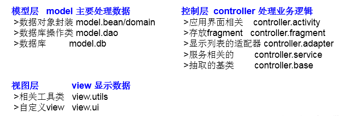

   3. JDK中的主要包介绍：

      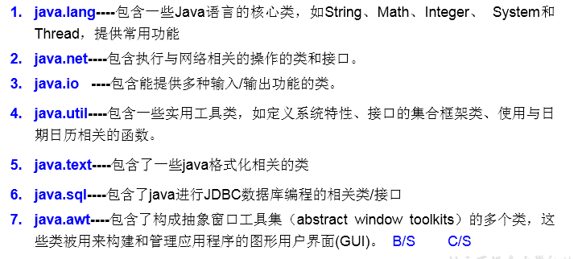

2. import的使用：import:导入

   1. 在源文件中显式的使用import结构导入指定包下的类、接口
   2. 声明在包的声明和类的声明之间
   3. 如果需要导入多个结构，则并列写出即可
   4. 可以使用"xxx.*"的方式，表示可以导入xxx包下的所有结构
   5. 如果使用的类或接口是java.lang包下定义的，则可以省略import结构
   6. 如果使用的类或接口是本包下定义的，则可以省略import结构
   7. 如果在源文件中，使用了不同包下的同名的类，则必须至少有一个类需要以全类名的方式显示。
   8. 使用"xxx.*"方式表明可以调用xxx包下的所有结构。但是如果使用的是xxx子包下的结构，则仍需要显式导入
   9. import static:导入指定类或接口中的静态结构:属性或方法。 

   

## 5.面向对象-中

### 面向对象的特征二：继承性

1. 为什么要有类的继承性？(继承性的好处）

   1. 减少了代码的冗余，提高了代码的复用性

    2. 便于功能的扩展

    3. 为之后多态性的使用，提供了前提

       图示：

       

 2. 继承性的格式：class A extends B{}

     1. A:子类、派生类、subclass
     2. B:父类、超类、基类、superclass

 3. 子类继承父类以后有哪些不同？

     1. 体现：一旦子类A继承父类B以后，子类A中就获取了父类B中声明的所有的属性和方法。
         *    	特别的，父类中声明为private的属性或方法，子类继承父类以后，仍然认为获取了父类中私有的结构。
         *    只有因为封装性的影响，使得子类不能直接调用父类的结构而已。
     2. 子类继承父类以后，还可以声明自己特有的属性或方法：实现功能的拓展。
         *    子类和父类的关系，不同于子集和集合的关系。
         *    extends：延展、扩展

 4. Java中关于继承性的规定

     1. 一个类可以被多个子类继承。

     2. Java中类的单继承性：一个类只能有一个父类

     3. 子父类是相对的概念。

     4. 子类直接继承的父类，称为：直接父类。间接继承的父类称为：间接父类

     5. 子类继承父类以后，就获取了直接父类以及所有间接父类中声明的属性和方法

        图示：

        

 5. java.lang.Object类的理解

     1. 如果我们没有显式的声明一个类的父类的话，则此类继承于java.lang.Object类
     2. 所有的java类（除java.lang.Object类之外）都直接或间接的继承于java.lang.Object类
     3. 意味着，所有的java类具有java.lang.Object类声明的功能。

### 方法的重写

1. 什么是方法的重写(override 或 overwrite)？子类继承父类以后，可以对父类中同名同参数的方法，进行覆盖操作

2. 应用：重写以后，当创建子类对象以后，通过子类对象调用子父类中的同名同参数的方法时，实际执行的是子类重写父类的方法。

3. 举例：

   ```java
   class Circle{
   public double findArea(){}//求面积
   }
   class Cylinder extends Circle{
   public double findArea(){}//求表面积
   }
   ***************
   class Account{
   public boolean withdraw(double amt){}
   }
   class CheckAccount extends Account{
   public boolean withdraw(double amt){}
   }
   ```

   

4. 重写的规则：

   方法的声明： 

   ```java
   权限修饰符  返回值类型  方法名(形参列表) throws 异常的类型{
   	//方法体
   }
   ```

   约定俗称：子类中的叫重写的方法，父类中的叫被重写的方法

   1. 子类重写的方法的方法名和形参列表与父类被重写的方法的方法名和形参列表相同
   2. 子类重写的方法的权限修饰符不小于父类被重写的方法的权限修饰符
      1. 特殊情况：子类不能重写父类中声明为private权限的方法
   3. 返回值类型：
      1. 父类被重写的方法的返回值类型是void，则子类重写的方法的返回值类型只能是void
      2. 父类被重写的方法的返回值类型是A类型，则子类重写的方法的返回值类型可以是A类或A类的子类
      3. 父类被重写的方法的返回值类型是基本数据类型(比如：double)，则子类重写的方法的返回值类型必须是相同的基本数据类型(必须也是double)
   4. 子类重写的方法抛出的异常类型不大于父类被重写的方法抛出的异常类型（具体放到异常处理时候讲）
   5. 补充：子类和父类中的同名同参数的方法要么都声明为非static的（考虑重写），要么都声明为static的（不是重写）。

5. 面试题：区分方法的重写和重载？

   ① 二者的概念：

   ② 重载和重写的具体规则

   ③ 重载：不表现为多态性。

   ​	 重写：表现为多态性。

   重载，是指允许存在多个同名方法，而这些方法的参数不同。编译器根据方法不同的参数表，对同名方法的名称做修饰。对于编译器而言，这些同名方法就成了不同的方法。**它们的调用地址在编译期就绑定了**。Java的重载是可以包括父类和子类的，即子类可以重载父类的同名不同参数的方法。
   所以：对于重载而言，在方法调用之前，编译器就已经确定了所要调用的方法，这称为“**早绑定”或“静态绑定”**；

   而对于多态，只等到方法调用的那一刻，解释运行器才会确定所要调用的具体方法，这称为“**晚绑定”或“动态绑定”**。 

   引用一句Bruce Eckel的话：**“不要犯傻，如果它不是晚绑定，它就不是多态。”**

### 关键字：super

1. super理解为：父类的
2. 可以用来调用的结构：属性、方法、构造器
3. super的使用：调用属性和方法
   1. 我们可以在子类的方法或构造器中。通过使用"super.属性"或"super.方法"的方式，显式的调用父类中声明的属性或方法。但是，通常情况下，我们习惯省略"super."
   2. 特殊情况：当子类和父类中定义了同名的属性时，我们要想在子类中调用父类中声明的属性，则必须显式的使用"super.属性"的方式，表明调用的是父类中声明的属性。
   3. 特殊情况：当子类重写了父类中的方法以后，我们想在子类的方法中调用父类中被重写的方法时，则必须显式的使用"super.方法"的方式，表明调用的是父类中被重写的方法。
4. super调用构造器
   1. 我们可以在子类的构造器中显式的使用"super(形参列表)"的方式，调用父类中声明的指定的构造器
   2. "super(形参列表)"的使用，必须声明在子类构造器的首行！
   3. 我们在类的构造器中，针对于"this(形参列表)"或"super(形参列表)"只能二选一，不能同时出现
   4. 在构造器的首行，没有显式的声明"this(形参列表)"或"super(形参列表)"，则默认调用的是父类中空参的构造器：super()
   5. 在类的多个构造器中，至少有一个类的构造器中使用了"super(形参列表)"，调用父类中的构造器

### 子类对象实例化全过程

1. 从结果上来看：（继承性）

   1. 子类继承父类以后，就获取了父类中声明的属性或方法。
   2. 创建子类的对象，在堆空间中，就会加载所有父类中声明的属性。

2. 从过程上来看：

   1. 当我们通过子类的构造器创建子类对象时，我们一定会直接或间接的调用其父类的构造器，进而调用父类的父类的构造器，...直到调用了java.lang.Object类中空参的构造器为止。
   2. 正因为加载过所有的父类的结构，所以才可以看到内存中有父类中的结构，子类对象才可以考虑进行调用。

   图示：

   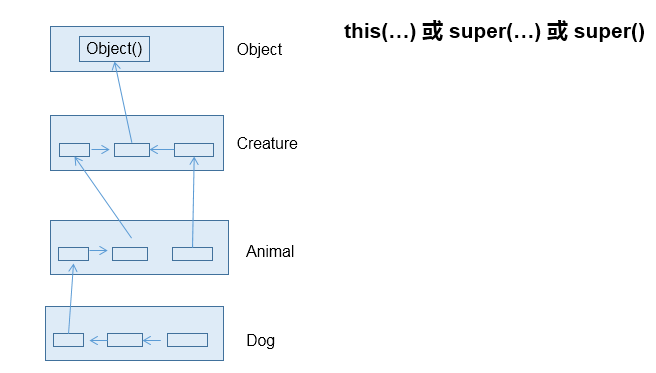

3. 强调说明：虽然创建子类对象时，调用了父类的构造器，但是自始至终就创建过一个对象，即为new的子类对象。

   

### 面向对象的特征三：多态性

1. 多态性的理解：可以理解为一个事物的多种形态。

2. 何为多态性：对象的多态性：父类的引用指向子类的对象（或子类的对象赋给父类的引用）

   举例：

   ```java
   Person p = new Man();
   Object obj = new Date();
   ```

   

3. 多态性的使用：虚拟方法调用

   1. 有了对象的多态性以后，我们在编译期，只能调用父类中声明的方法，但在运行期，我们实际执行的是子类重写父类的方法。
   2. 总结：编译，看左边；运行，看右边。

4. 多态性的使用前提：  ① 类的继承关系  ② 方法的重写

5. 多态性的应用举例：

   1. 举例一：

      ```java
      public void func(Animal animal){//Animal animal = new Dog();
      		animal.eat();
      		animal.shout();
      	}
      ```

      

   2. 举例二：

      ```java
      public void method(Object obj){
      		
      	}
      ```

      

   3. 举例三：

      ```java
      class Driver{
      	
      	public void doData(Connection conn){//conn = new MySQlConnection(); / conn = new OracleConnection();
      		//规范的步骤去操作数据
      //		conn.method1();
      //		conn.method2();
      //		conn.method3();
      		
      	}
      	
      }
      ```

      

6. 多态性使用的注意点：对象的多态性，只适用于方法，不适用于属性（编译和运行都看左边）

7. 关于向上转型与向下转型：

   1. 向上转型：多态

   2. 向下转型：

      1. 为什么使用向下转型：有了对象的多态性以后，内存中实际上是加载了子类特有的属性和方法的，但是由于变量声明为父类类型，导致编译时，只能调用父类中声明的属性和方法。子类特有的属性和方法不能调用。如何才能调用子类特的属性和方法？使用向下转型。

      2. 如何实现向下转型：使用强制类型转换符：()

      3. 使用时的注意点：

         1. 使用强转时，可能出现ClassCastException的异常。
         2. 使用强转时，可能出现ClassCastException的异常。
            ② 为了避免在向下转型时出现ClassCastException的异常，我们在向下转型之前，先进行instanceof的判断，一旦返回true，就进行向下转型。如果返回false，不进行向下转型。

      4. instanceof的使用：

         1. a instanceof A:判断对象a是否是类A的实例。如果是，返回true；如果不是，返回false。
         2. 如果 a instanceof A返回true,则 a instanceof B也返回true.其中，类B是类A的父类。
         3. 要求a所属的类与类A必须是子类和父类的关系，否则编译错误。

      5. 图示：

         

8. 面试题：

   1. 谈谈你对多态性的理解？

      1. 实现代码的通用性。

      2. Object类中定义的public boolean equals(Object obj){  }

          JDBC:使用java程序操作(获取数据库连接、CRUD)数据库(MySQL、Oracle、DB2、SQL Server)

      3. 抽象类、接口的使用肯定体现了多态性。（抽象类、接口不能实例化）

   2. 多态是编译时行为还是运行时行为？运行时行为

### Object类的使用

1. java.lang.Object类的说明：

   1. Object类是所有Java类的根父类
   2. 如果在类的声明中未使用extends关键字指明其父类，则默认父类为java.lang.Object类
   3. Object类中的功能(属性、方法)就具有通用性。
      1. 属性：无
      2. 方法：equals() / toString() / getClass() /hashCode() / clone() / finalize()/wait() /notify()/notifyAll()
   4. Object类只声明了一个空参的构造器

2. equals()方法

   1. equals()的使用：

      1. 是一个方法，而非运算符

      2. 只能适用于引用数据类型

      3. Object类中equals()的定义：

         ```java
         public boolean equals(Object obj) {
         	        return (this == obj);
         	  }
         ```

         说明：Object类中定义的equals()和==的作用是相同的：比较两个对象的地址值是否相同.即两个引用是否指向同一个对象实体

      4. 像String、Date、File、包装类等都重写了Object类中的equals()方法。重写以后，比较的不是两个引用的地址是否相同，而是比较两个对象的"实体内容"是否相同。

      5. 通常情况下，我们自定义的类如果使用equals()的话，也通常是比较两个对象的"实体内容"是否相同。那么，我们就需要对Object类中的equals()进行重写.

          *    重写的原则：比较两个对象的实体内容是否相同.

   2. 如何重写equals()

      1. 手动重写举例：

         ```java
         class User{
         String name;
         int age;
         	//重写其equals()方法
         	public boolean equals(Object obj){
         		if(obj == this){
         			return true;
         		}
         		if(obj instanceof User){
         			User u = (User)obj;
         			return this.age == u.age && this.name.equals(u.name);
         		}
         		return false;
         	}
         }
         ```

         

      2. 开发中如何实现：自动生成的

   3. 回顾 == 运算符的使用：

      1. 可以使用在基本数据类型变量和引用数据类型变量中
      2. 如果比较的是基本数据类型变量：比较两个变量保存的数据是否相等。（不一定类型要相同）
      3. 如果比较的是引用数据类型变量：比较两个对象的地址值是否相同.即两个引用是否指向同一个对象实体
      4. 补充： == 符号使用时，必须保证符号左右两边的变量类型一致。

3. toString()方法

   1. toString()的使用：

      1. 当我们输出一个对象的引用时，实际上就是调用当前对象的toString()

      2. Object类中toString()的定义：

         ```java
         public String toString() {
                 return getClass().getName() + "@" + Integer.toHexString(hashCode());
              }
         ```

         

      3. 像String、Date、File、包装类等都重写了Object类中的toString()方法。使得在调用对象的toString()时，返回"实体内容"信息

      4. 自定义类也可以重写toString()方法，当调用此方法时，返回对象的"实体内容"

   2. 如何重写toString()

      举例：

      ```java
      //自动实现
      	@Override
      	public String toString() {
      		return "Customer [name=" + name + ", age=" + age + "]";
      	}
      ```

      

4. 面试题：

   1.  final、finally、finalize的区别？
   2.  == 和 equals() 区别

### 单元测试方法

Java中的JUnit单元测试

1. 步骤：
   1. 选中当前工程 - 右键选择：build path - add libraries - JUnit 4 - 下一步
   2. 创建Java类，进行单元测试。此时的Java类要求：**① 此类是public的  ②此类提供公共的无参的构造器**
   3. 此类中声明单元测试方法。 此时的单元测试方法：**方法的权限是public,没有返回值，没有形参**
   4. 此单元测试方法上需要声明注解：@Test,并在单元测试类中导入：import org.junit.Test;
   5. 声明好单元测试方法以后，就可以在方法体内测试相关的代码。
   6. 写完代码以后，左键双击单元测试方法名，右键：run as - JUnit Test
2. 说明：
   1. 如果执行结果没有任何异常：绿条
   2. 如果执行结果出现异常：红条

### 包装类的使用

1. 为什么要有包装类(或封装类）？

   java提供了8种基本数据类型对应的包装类，使得基本数据类型的变量具有类的特征

2. 基本数据类型与对应的包装类：

   

3. 需要掌握的类型间的转换：（基本数据类型、包装类、String）

   

   1. 简易版：

      1. 基本数据类型<--->包装类：JDK 5.0 新特性：自动装箱 与自动拆箱
      2. 基本数据类型、包装类--->String:调用String重载的valueOf(Xxx xxx)
      3. String--->基本数据类型、包装类:调用包装类的parseXxx(String s)

      - 注意：转换时，可能会报NumberFormatException

   2. 应用场景举例：

      Vector类中关于添加元素，只定义了形参为Object类型的方法：
      v.addElement(Object obj);   //基本数据类型 --->包装类 --->使用多态


## 6.面向对象-下

### 关键字：static

static:静态的

1. 可以用来修饰的结构：主要用来修饰类的内部结构-------->属性、方法、代码块、内部类

2. static修饰属性：静态变量（或类变量）

   1. 属性，按是否使用static修饰，又分为：静态属性  vs 非静态属性(实例变量)

      1. 实例变量：我们创建了类的多个对象，每个对象都独立的拥有一套类中的非静态属性。当修改其中一个对象中的非静态属性时，不会导致其他对象中同样的属性值的修改。
      2. 静态变量：我们创建了类的多个对象，多个对象共享同一个静态变量。当通过某一个对象修改静态变量时，会导致其他对象调用此静态变量时，是修改过了的。

   2. static修饰属性的其他说明：

      1. 静态变量随着类的加载而加载。可以通过"类.静态变量"的方式进行调用

      2. 静态变量的加载要早于对象的创建。

      3. 由于类只会加载一次，则静态变量在内存中也只会存在一份：存在方法区的静态域中。

      4. |      | 类变量 | 类变量 |
         | ---- | ------ | ------ |
         | 类   | yes    | no     |
         | 对象 | yes    | yes    |

   3. 静态属性举例：System.out; Math.PI;

3. 静态变量内存解析：

   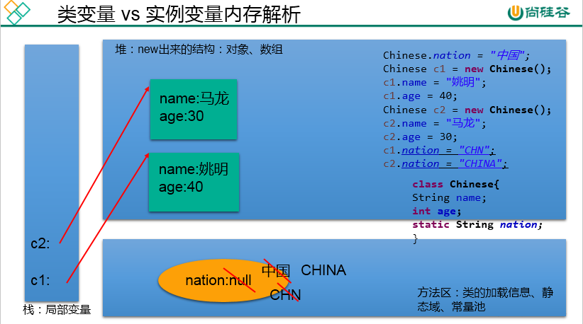

4. static修饰方法：静态方法、类方法

   1. 随着类的加载而加载，可以通过"类.静态方法"的方式进行调用

   2. |      | 静态方法 | 非静态方法 |
      | ---- | -------- | ---------- |
      | 类   | yes      | no         |
      | 对象 | yes      | yes        |

   3. 静态方法中，只能调用静态的方法或属性;

      非静态方法中，既可以调用非静态的方法或属性，也可以调用静态的方法或属性

5. static注意点：

   1. 在静态的方法内，不能使用this关键字、super关键字
   2. 关于静态属性和静态方法的使用，大家都从生命周期的角度去理解。

6. 开发中，如何确定一个属性是否要声明为static的？

   1. 属性是可以被多个对象所共享的，不会随着对象的不同而不同的。
   2. 类中的常量也常常声明为static

   开发中，如何确定一个方法是否要声明为static的？

   1. 操作静态属性的方法，通常设置为static的
   2. 工具类中的方法，习惯上声明为static的。 比如：Math、Arrays、Collections

7. 使用举例：

   1. 举例一：Arrays、Math、Collections等工具类

   2. 举例二：单例模式

   3. 举例三：

      ```java
      class Circle{
      	
      	private double radius;
      	private int id;//自动赋值
      	
      	public Circle(){
      		id = init++;
      		total++;
      	}
      	
      	public Circle(double radius){
      		this();
      //		id = init++;
      //		total++;
      		this.radius = radius;
      		
      	}
      	
      	private static int total;//记录创建的圆的个数
      	private static int init = 1001;//static声明的属性被所对象所共享
      	
      	public double findArea(){
      		return 3.14 * radius * radius;
      	}
      
      	public double getRadius() {
      		return radius;
      	}
      
      	public void setRadius(double radius) {
      		this.radius = radius;
      	}
      
      	public int getId() {
      		return id;
      	}
      
      	public static int getTotal() {
      		return total;
      	}
      
      }
      
      ```

#### 单例模式

1. 设计模式的说明

   1. 理解：设计模式是在大量的实践中总结和理论化之后优的代码结构、编程风格、以及解决问题的思考方式。
   2. 常用设计模式  --- 23种经典的设计模式  GOF
      1. 创建型模式，共5种：工厂方法模式、抽象工厂模式、单例模式、建造者模式、原型模式。 
      2. 结构型模式，共7种：适配器模式、装饰器模式、代理模式、外观模式、桥接模式、组合模式、享元模式。 
      3. 行为型模式，共11种：策略模式、模板方法模式、观察者模式、迭代器模式、责任链模式、命令模式、备忘录模式、状态模式、访问者模式、中介者模式、解释器模式。 

2. 单例模式

   1. 要解决的问题：所谓类的单例设计模式，就是采取一定的方法保证在整个的软件系统中，对某个类只能存在一个对象实例。

   2. 具体代码的实现：

      1. 饿汉式1：

         ```java
         class Bank{
         	
         	//1.私化类的构造器
         	private Bank(){
         		
         	}
         	
         	//2.内部创建类的对象
         	//4.要求此对象也必须声明为静态的
         	private static Bank instance = new Bank();
         	
         	//3.提供公共的静态的方法，返回类的对象
         	public static Bank getInstance(){
         		return instance;
         	}
         }
         ```

         

      2. 饿汉式2：使用了静态代码块

         ```java
         class Order{
         	
         	//1.私化类的构造器
         	private Order(){
         		
         	}
         	
         	//2.声明当前类对象，没初始化
         	//4.此对象也必须声明为static的
         	private static Order instance = null;
         
         	static{
         		instance = new Order();
          }
         	
         	//3.声明public、static的返回当前类对象的方法
         	public static Order getInstance(){
         		return instance;
         	}
         	
         }
         ```

         

      3. 懒汉式：

         ```java
         class Order{
         	
         	//1.私化类的构造器
         	private Order(){
         		
         	}
         	
         	//2.声明当前类对象，没初始化
         	//4.此对象也必须声明为static的
         	private static Order instance = null;
         	
         	//3.声明public、static的返回当前类对象的方法
         	public static Order getInstance(){
         		
         		if(instance == null){
         			
         			instance = new Order();
         			
         		}
         		return instance;
         	}
         	
         }
         ```

         

   3. 两种方式的对比：

      1. 饿汉式：
         1. 坏处：对象加载时间过长。
         2. 好处：饿汉式是线程安全的
      2. 懒汉式：
         1. 好处：延迟对象的创建。
         2. 目前的写法坏处：线程不安全。--->到多线程内容时，再修改


### main()的使用说明

1. main()方法作为程序的入口
2. main()方法也是一个普通的静态方法
3. main()方法可以作为我们与控制台交互的方式。（之前：使用Scanner）

如何将控制台获取的数据传给形参：

```java
String[] args?
  运行时：java 类名 "Tom" "Jerry" "123" "true"

sysout(args[0]);//"Tom"
sysout(args[3]);//"true"  -->Boolean.parseBoolean(args[3]);
sysout(args[4]);//报异常
```

**小结：一叶知秋**

`public static void main(String[] args){//方法体}`

- 权限修饰符：private 缺省 protected pubilc ---->封装性
- 修饰符：static \ final \ abstract \native 可以用来修饰方法
- 返回值类型： 无返回值 / 有返回值 -->return
  方法名：需要满足标识符命名的规则、规范；"见名知意"
- 形参列表：重载 vs 重写；参数的值传递机制；体现对象的多态性
- 方法体：来体现方法的功能

### 类的结构：代码块

类的成员之四：代码块(初始化块)（重要性较属性、方法、构造器差一些）

1. 代码块的作用：用来初始化类、对象的信息

2. 分类：代码块要是使用修饰符，只能使用static

   分类：静态代码块  vs 非静态代码块

3. 静态代码块

   1. 内部可以有输出语句
   2. 随着类的加载而执行,而且只执行一次
   3. 作用：初始化类的信息
   4. 如果一个类中定义了多个静态代码块，则按照声明的先后顺序执行
   5. 静态代码块的执行要优先于非静态代码块的执行
   6. 静态代码块内只能调用静态的属性、静态的方法，不能调用非静态的结构

4. 非静态代码块

   1. 内部可以有输出语句
   2. 随着对象的创建而执行
   3. 每创建一个对象，就执行一次非静态代码块
   4. 作用：可以在创建对象时，对对象的属性等进行初始化
   5. 如果一个类中定义了多个非静态代码块，则按照声明的先后顺序执行
   6. 非静态代码块内可以调用静态的属性、静态的方法，或非静态的属性、非静态的方法

5. 实例化子类对象时，涉及到父类、子类中静态代码块、非静态代码块、构造器的加载顺序：由父及子，静态先行。

#### 属性的赋值顺序

①默认初始化

②显式初始化/⑤在代码块中赋值

③构造器中初始化

④有了对象以后，可以通过"对象.属性"或"对象.方法"的方式，进行赋值

执行的先后顺序：① - ② / ⑤ - ③ - ④

### 关键字：final

final：最终的

1. final可以用来修饰的结构：类、方法、变量

2. 具体的：

   1. final 用来修饰一个类:此类不能被其他类所继承。比如：String类、System类、StringBuffer类

   2. final 用来修饰方法：表明此方法不可以被重写，比如：Object类中getClass();

   3. final 用来修饰变量：此时的"变量"就称为是一个常量

      1. final修饰属性：可以考虑赋值的位置有：显式初始化、代码块中初始化、构造器中初始化
      2. final修饰局部变量：尤其是使用final修饰形参时，表明此形参是一个常量。当我们调用此方法时，给常量形参赋一个实参。一旦赋值以后，就只能在方法体内使用此形参，但不能进行重新赋值。

      - static final 用来修饰属性：全局常量

### 关键字：abstract

abstract: 抽象的

1. 可以用来修饰：类、方法

2. 具体的：

   1. abstract修饰类：抽象类

      1. 此类不能实例化
      2. 抽象类中一定有构造器，便于子类实例化时调用（涉及：子类对象实例化的全过程）
      3. 开发中，都会提供抽象类的子类，让子类对象实例化，完成相关的操作

   2. abstract修饰方法：抽象方法

      1. 抽象方法只有方法的声明，没有方法体

      2. 包含抽象方法的类，一定是一个抽象类。反之，抽象类中可以没有抽象方法的。

      3. 若子类重写了父类中的所有的抽象方法后，此子类方可实例化

         若子类没有重写父类中的所有的抽象方法，则此子类也是一个抽象类，需要使用abstract修饰

3. 注意点：

   1. abstract不能用来修饰：属性、构造器等结构
   2. abstract不能用来修饰私方法、静态方法、final的方法、final的类

4. abstract的应用举例：

   1. 举例一：

      

   2. 举例二：

      ```java
      abstract class GeometricObject{
      public abstract double findArea();
      }
      class Circle extends GeometricObject{
      private double radius;
      public double findArea(){
      		return 3.14 * radius * radius;
      };
      }
      ```

      

   3. 举例三：IO流中设计到的抽象类：InputStream/OutputStream / Reader /Writer。在其内部
      定义了抽象的read()、write()方法。

#### 模板方法的设计模式

1. 解决的问题：在软件开发中实现一个算法时，整体步骤很固定、通用，这些步骤已经在父类中写好了。但是某些部分易变，易变
   部分可以抽象出来，供不同子类实现。这就是一种模板模式。

2. 举例

   ```java
   abstract class Template{
   	
   	//计算某段代码执行所需要花费的时间
   	public void spendTime(){
   		
   		long start = System.currentTimeMillis();
   		
   		this.code();//不确定的部分、易变的部分
   		
   		long end = System.currentTimeMillis();
   		
   		System.out.println("花费的时间为：" + (end - start));
   		
   	}
   	
   	public abstract void code();
   	
   }
   
   class SubTemplate extends Template{
   
   	@Override
   	public void code() {
   		
   		for(int i = 2;i <= 1000;i++){
   			boolean isFlag = true;
   			for(int j = 2;j <= Math.sqrt(i);j++){
   				
   				if(i % j == 0){
   					isFlag = false;
   					break;
   				}
   			}
   			if(isFlag){
   				System.out.println(i);
   			}
   		}
   
   	}
   	
   }
   ```

   

3. 应用场景

   

### 关键字：interface

interface:接口

1. 使用说明：

   1. 接口使用interface来定义

   2. Java中，接口和类是并列的两个结构

   3. 如何定义接口：定义接口中的成员

      1. JDK7及以前：只能定义全局常量和抽象方法
         1. 全局常量：public static final的.但是书写时，可以省略不写
         2. 抽象方法：public abstract的
      2. JDK8：除了定义全局常量和抽象方法之外，还可以定义静态方法、默认方法（略）

   4. 接口中不能定义构造器的！意味着接口不可以实例化

   5. Java开发中，接口通过让类去实现(implements)的方式来使用.

      如果实现类覆盖了接口中的所有抽象方法，则此实现类就可以实例化

      如果实现类没有覆盖接口中所有的抽象方法，则此实现类仍为一个抽象类

   6. Java类可以实现多个接口   --->弥补了Java单继承性的局限性

      格式：class AA extends BB implements CC,DD,EE

   7. 接口与接口之间可以继承，而且可以多继承

   8. 接口的具体使用，体现多态性

   9. 接口，实际上可以看做是一种规范

2. 举例：

   

   ```java
   class Computer{
   	
   	public void transferData(USB usb){//USB usb = new Flash();
   		usb.start();
   		
   		System.out.println("具体传输数据的细节");
   		
   		usb.stop();
   	}
   	
   	
   }
   
   interface USB{
   	//常量：定义了长、宽、最大最小的传输速度等
   	
   	void start();
   	
   	void stop();
   	
   }
   
   class Flash implements USB{
   
   	@Override
   	public void start() {
   		System.out.println("U盘开启工作");
   	}
   
   	@Override
   	public void stop() {
   		System.out.println("U盘结束工作");
   	}
   	
   }
   
   class Printer implements USB{
   	@Override
   	public void start() {
   		System.out.println("打印机开启工作");
   	}
   
   	@Override
   	public void stop() {
   		System.out.println("打印机结束工作");
   	}
   	
   }
   ```

   体会：
    * 1.接口使用上也满足多态性
    * 2.接口，实际上就是定义了一种规范
    * 3.开发中，体会面向接口编程！	

3. 体会面向接口编程的思想

   

   面向接口编程：我们在应用程序中，调用的结构都是JDBC中定义的接口，不会出现具体某一个
   数据库厂商的API。

4. Java8中关于接口的新规范

   1. 知识点1：接口中定义的静态方法，只能通过接口来调用。

   2. 知识点2：通过实现类的对象，可以调用接口中的默认方法。

      如果实现类重写了接口中的默认方法，调用时，仍然调用的是重写以后的方法

   3. 知识点3：如果子类(或实现类)继承的父类和实现的接口中声明了同名同参数的默认方法，那么子类在没重写此方法的情况下，默认调用的是父类中的同名同参数的方法。-->类优先原则

   4. 知识点4：如果实现类实现了多个接口，而这多个接口中定义了同名同参数的默认方法，那么在实现类没重写此方法的情况下，报错。-->接口冲突。

      这就需要我们必须在实现类中重写此方法

   5. 知识点5：如何在子类(或实现类)的方法中调用父类、接口中被重写的方法

      ```java
      	public void myMethod(){
      		method3();//调用自己定义的重写的方法
      		super.method3();//调用的是父类中声明的
      		//调用接口中的默认方法
      		CompareA.super.method3();
      		CompareB.super.method3();
      	}
      ```

      

5. 面试题：抽象类和接口的异同？

   1. 相同点：不能实例化；都可以包含抽象方法的。
   2. 不同点：
      1. 把抽象类和接口(java7,java8,java9)的定义、内部结构解释说明
      2. 类：单继承性    接口：多继承
            类与接口：多实现

#### 代理模式

1. 解决的问题：代理模式是Java开发中使用较多的一种设计模式。代理设计就是为其他对象提供一种代理以控制对这个对象的访问。

2. 举例

   ```java
   interface NetWork{
   	
   	public void browse();
   	
   }
   
   //被代理类
   class Server implements NetWork{
   
   	@Override
   	public void browse() {
   		System.out.println("真实的服务器访问网络");
   	}
   
   }
   //代理类
   class ProxyServer implements NetWork{
   	
   	private NetWork work;
   	
   	public ProxyServer(NetWork work){
   		this.work = work;
   	}
   	
   
   	public void check(){
   		System.out.println("联网之前的检查工作");
   	}
   	
   	@Override
   	public void browse() {
   		check();
   		
   		work.browse();
   		
   	}
   	
   }
   
   ```

   

3. 应用场景

   

#### 工厂的设计模式

1. 解决的问题：实现了创建者与调用者的分离，即将创建对象的具体过程屏蔽隔离起来，达到提高灵活性的目的。
2. 具体模式
   1. 简单工厂模式：用来生产同一等级结构中的任意产品。（对于增加新的产品，需要修改已有代码）
   2. 工厂方法模式：用来生产同一等级结构中的固定产品。（支持增加任意产品)
   3. 抽象工厂模式：用来生产不同产品族的全部产品。（对于增加新的产品，无能为力；支持增加产品族)

### 类的结构：内部类

内部类：类的第五个成员

1. 定义：Java中允许将一个类A声明在另一个类B中，则类A就是内部类，类B称为外部类

2. 内部类的分类：成员内部类（静态、非静态）  vs 局部内部类(方法内、代码块内、构造器内)

3. 成员内部类的理解：

   1. 一方面，作为外部类的成员：
      1. 调用外部类的结构
      2. 可以被static修饰
      3. 可以被4种不同的权限修饰
   2. 另一方面，作为一个类：
      1. 类内可以定义属性、方法、构造器等
      2. 可以被final修饰，表示此类不能被继承。言外之意，不使用final，就可以被继承
      3. 可以被abstract修饰

4. 成员内部类：

   1. 如何创建成员内部类的对象？(静态的，非静态的)

      ```java
      //创建静态的Dog内部类的实例(静态的成员内部类):
      Person.Dog dog = new Person.Dog();
      
      //创建非静态的Bird内部类的实例(非静态的成员内部类):
      //Person.Bird bird = new Person.Bird();//错误的
      Person p = new Person();
      Person.Bird bird = p.new Bird();
      ```

      

   2. 如何在成员内部类中调用外部类的结构？

      ```java
      class Person{
      	String name = "小明";
      public void eat(){
      }
      //非静态成员内部类
      	class Bird{
      		String name = "杜鹃";
      		public void display(String name){
      			System.out.println(name);//方法的形参
      			System.out.println(this.name);//内部类的属性
      			System.out.println(Person.this.name);//外部类的属性
      		//Person.this.eat();
      		}
      	}
      }
      ```

      

5. 局部内部类的使用：

   ```java
   	//返回一个实现了Comparable接口的类的对象
   	public Comparable getComparable(){
   		
   		//创建一个实现了Comparable接口的类:局部内部类
   		//方式一：
   //		class MyComparable implements Comparable{
   //
   //			@Override
   //			public int compareTo(Object o) {
   //				return 0;
   //			}
   //			
   //		}
   //		
   //		return new MyComparable();
   		
   		//方式二：
   		return new Comparable(){
   
   			@Override
   			public int compareTo(Object o) {
   				return 0;
   			}
   			
   		};
   		
   	}
   ```

   

6. 注意点：在局部内部类的方法中（比如：show如果调用局部内部类所声明的方法(比如：method)中的局部变量(比如：num)的话,要求此局部变量声明为final的。

   1. jdk 7及之前版本：要求此局部变量显式的声明为final的
   2. jdk 8及之后的版本：可以省略final的声明

7. 总结：

   1. 成员内部类和局部内部类，在编译以后，都会生成字节码文件。
   2. 格式：
      1. 成员内部类：外部类$内部类名.class
      2. 局部内部类：外部类$数字 内部类名.class

## 7.异常处理

### 异常

1. 异常的体系结构

   ```java
    * java.lang.Throwable
    * 		|-----java.lang.Error:一般不编写针对性的代码进行处理。
    * 		|-----java.lang.Exception:可以进行异常的处理
    * 			|------编译时异常(checked)
    * 					|-----IOException
    * 						|-----FileNotFoundException
    * 					|-----ClassNotFoundException
    * 			|------运行时异常(unchecked,RuntimeException)
    * 					|-----NullPointerException
    * 					|-----ArrayIndexOutOfBoundsException
    * 					|-----ClassCastException
    * 					|-----NumberFormatException
    * 					|-----InputMismatchException
    * 					|-----ArithmeticException
   ```

   

2. 从程序执行过程，看编译时异常和运行时异常

   

   - 编译时异常：执行javac.exe命名时，可能出现的异常
   - 运行时异常：执行java.exe命名时，出现的异常

3. 常见的异常类型，请举例说明：

   ```java
   //******************以下是运行时异常***************************
   	//ArithmeticException
   	@Test
   	public void test6(){
   		int a = 10;
   		int b = 0;
   		System.out.println(a / b);
   	}
   	
   	//InputMismatchException
   	@Test
   	public void test5(){
   		Scanner scanner = new Scanner(System.in);
   		int score = scanner.nextInt();
   		System.out.println(score);
   		
   		scanner.close();
   	}
   	
   	//NumberFormatException
   	@Test
   	public void test4(){
   		
   		String str = "123";
   		str = "abc";
   		int num = Integer.parseInt(str);
   		
   	}
   	
   	//ClassCastException
   	@Test
   	public void test3(){
   		Object obj = new Date();
   		String str = (String)obj;
   	}
   	
   	//IndexOutOfBoundsException
   	@Test
   	public void test2(){
   		//ArrayIndexOutOfBoundsException
   //		int[] arr = new int[10];
   //		System.out.println(arr[10]);
   		//StringIndexOutOfBoundsException
   		String str = "abc";
   		System.out.println(str.charAt(3));
   	}
   	
   	//NullPointerException
   	@Test
   	public void test1(){
   		
   //		int[] arr = null;
   //		System.out.println(arr[3]);
   		
   		String str = "abc";
   		str = null;
   		System.out.println(str.charAt(0));
   		
   	}
   
   	//******************以下是编译时异常***************************
   	@Test
   	public void test7(){
   //		File file = new File("hello.txt");
   //		FileInputStream fis = new FileInputStream(file);
   //		
   //		int data = fis.read();
   //		while(data != -1){
   //			System.out.print((char)data);
   //			data = fis.read();
   //		}
   //		
   //		fis.close();
   		
   	}
   ```

   

### 异常的处理

1. java异常处理的抓抛模型

   1. 过程一："抛"：程序在正常执行的过程中，一旦出现异常，就会在异常代码处生成一个对应异常类的对象,并将此对象抛出。

      一旦抛出对象以后，其后的代码就不再执行。

      关于异常对象的产生：① 系统自动生成的异常对象② 手动的生成一个异常对象，并抛出（throw）

   2. 过程二："抓"：可以理解为异常的处理方式：① try-catch-finally  ② throws

2. 异常处理方式一：try-catch-finally

   1. 使用说明：

      ```java
       * try{
       * 		//可能出现异常的代码
       * 
       * }catch(异常类型1 变量名1){
       * 		//处理异常的方式1
       * }catch(异常类型2 变量名2){
       * 		//处理异常的方式2
       * }catch(异常类型3 变量名3){
       * 		//处理异常的方式3
       * }
       * ....
       * finally{
       * 		//一定会执行的代码
       * }
      ```

      1. finally是可选的。

      2. 使用try将可能出现异常代码包装起来，在执行过程中，一旦出现异常，就会生成一个对应异常类的对象，根据此对象的类型，去catch中进行匹配

      3. 一旦try中的异常对象匹配到某一个catch时，就进入catch中进行异常的处理。一旦处理完成，就跳出当前的try-catch结构（在没有写finally的情况）。继续执行其后的代码

      4. catch中的异常类型如果没有子父类关系，则谁声明在上，谁声明在下无所谓。

         catch中的异常类型如果满足子父类关系，则要求子类一定声明在父类的上面。否则，报错

      5. 常用的异常对象处理的方式： ① String  getMessage()    ② printStackTrace()

      6. 在try结构中声明的变量，再出了try结构以后，就不能再被调用

      7. try-catch-finally结构可以嵌套

         总结：如何看待代码中的编译时异常和运行时异常？

         - 体会1：使用try-catch-finally处理编译时异常，是得程序在编译时就不再报错，但是运行时仍可能报错。相当于我们使用try-catch-finally将一个编译时可能出现的异常，延迟到运行时出现。
         - 体会2：开发中，由于运行时异常比较常见，所以我们通常就不针对运行时异常编写try-catch-finally了。针对于编译时异常，我们说一定要考虑异常的处理。

   2. finally的再说明：

      1. finally是可选的
      2. finally中声明的是一定会被执行的代码。即使catch中又出现异常了，try中有return语句，catch中有return语句等情况。
      3. 像数据库连接、输入输出流、网络编程Socket等资源，JVM是不能自动的回收的，我们需要自己手动的进行资源的释放。此时的资源释放，就需要声明在finally中。

   3. [面试题]final、finally、finalize三者的区别？

      ```java
      类似：
      throw 和 throws
      Collection 和 Collections
      String 、StringBuffer、StringBuilder
      ArrayList 、 LinkedList
      HashMap 、LinkedHashMap
      重写、重载
      
      结构不相似的：
      抽象类、接口
      == 、 equals()
      sleep()、wait()
      ```

      

3. 异常处理方式二：

   1. "throws + 异常类型"写在方法的声明处。指明此方法执行时，可能会抛出的异常类型。
   2. 一旦当方法体执行时，出现异常，仍会在异常代码处生成一个异常类的对象，此对象满足throws后异常类型时，就会被抛出。异常代码后续的代码，就不再执行！

4. 对比两种处理方式

   1. try-catch-finally:真正的将异常给处理掉了。
   2. throws的方式只是将异常抛给了方法的调用者。  并没有真正将异常处理掉。  

5. 体会开发中应该如何选择两种处理方式？

   1. 如果父类中被重写的方法没有throws方式处理异常，则子类重写的方法也不能使用throws，意味着如果子类重写的方法中有异常，必须使用try-catch-finally方式处理。
   2. 执行的方法a中，先后又调用了另外的几个方法，这几个方法是递进关系执行的。我们建议这几个方法使用throws的方式进行处理。而执行的方法a可以考虑使用try-catch-finally方式进行处理。

6. 补充：

   方法重写的规则之一：
   子类重写的方法抛出的异常类型不大于父类被重写的方法抛出的异常类型

### 手动抛出异常对象

1. 使用说明：在程序执行中，除了自动抛出异常对象的情况之外，我们还可以手动的throw一个异常类的对象。

2. [面试题]throw 和  throws区别：

   1. throw 表示抛出一个异常类的对象，生成异常对象的过程。声明在方法体内。
   2. throws 属于异常处理的一种方式，声明在方法的声明处。

3. 典型例题

   ```java
   class Student{
   	
   	private int id;
   	
   	public void regist(int id) throws Exception {
   		if(id > 0){
   			this.id = id;
   		}else{
   			//手动抛出异常对象
   //			throw new RuntimeException("您输入的数据非法！");
   //			throw new Exception("您输入的数据非法！");
   			throw new MyException("不能输入负数");
   
   		}
   		
   	}
   
   	@Override
   	public String toString() {
   		return "Student [id=" + id + "]";
   	}	
   }
   ```

### 自定义异常类

1. 如何自定义异常类？

   1. 继承于现的异常结构：RuntimeException 、Exception
   2. 提供全局常量：serialVersionUID
   3. 提供重载的构造器

2. 例子

   ```java
   public class MyException extends Exception{
   	
   	static final long serialVersionUID = -7034897193246939L;
   	
   	public MyException(){
   		
   	}
   	
   	public MyException(String msg){
   		super(msg);
   	}
   }
   ```

   
